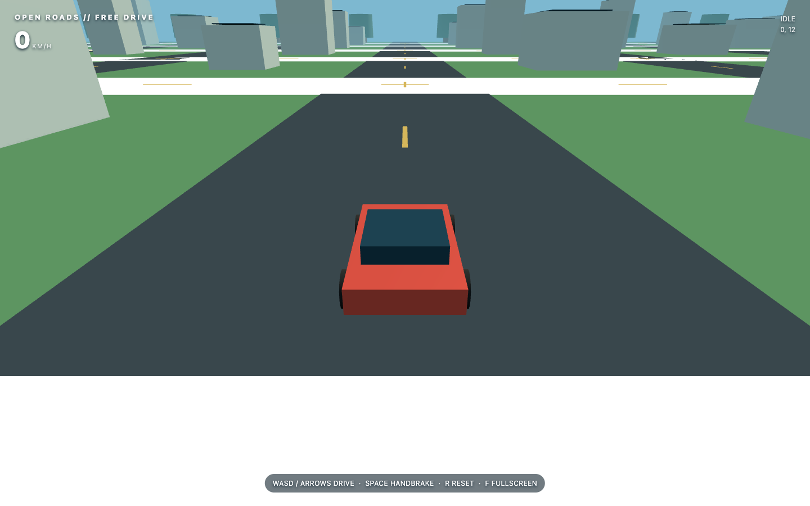

# Open Roads Driving Demo

A single-page Three.js driving experiment with a generated city, trees, a block-built car, a follow camera, speed display and simple driving/collision behavior.

## Features

- Accelerate with W or Up; brake/reverse with S or Down.
- Steer with A/D or Left/Right.
- Use Space for handbrake drifting, R to reset, and F to toggle fullscreen.
- Explore a procedural scene built from geometry rather than bundled model assets.

## Preview

The actual browser driving demo after starting the simulation. Use WASD or arrow keys to drive, Space for the handbrake, and R to reset.



## Setup and run

Use a modern browser with WebGL and JavaScript module/import-map support. Three.js 0.161.0 is loaded from jsDelivr, so internet access is required. No Node install or build step is needed.

```sh
python3 -m http.server 8000 --bind 127.0.0.1
```

Open `http://127.0.0.1:8000/` and use the on-page start control. Serve from the repository root.

## Validation

Inline JavaScript syntax and the import-map JSON passed local checks. Browser rendering, driving behavior and fullscreen interaction were not exercised. This is a mostly complete experiment rather than a validated physics simulation.

## Archival notes

Original application source is preserved. Generated files, machine metadata, private runtime data and teaching documents are excluded. No license has been inferred.
